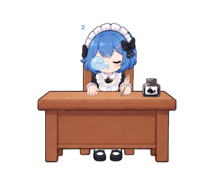
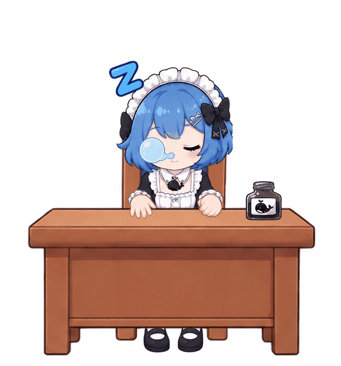

# 🐋 DSH 桌面宠物 / DSH Desktop Pet

一只住在你桌面上的小鲸鱼女仆，睡觉、被任务惊醒、认真写作业——全程由 AI 协作完成的桌面宠物。

A little whale-maid living on your desktop — sleeping, waking up for tasks, writing homework — a desktop pet built entirely through AI collaboration.





> 动画演示：睡眠（鼻涕泡呼吸）→ 唤醒（泡泡破裂+惊讶）→ 书写（手笔平移）→ 回睡，循环播放
> Animation demo: sleep (bubble breathing) → wake (bubble pop + surprise) → writing (hand & quill) → back to sleep, looping

> 画布 560×600，支持 60%~200% 六档等比缩放
> Canvas 560×600, 6-level proportional scaling from 60% to 200%

## 👋 作者的自我介绍 / About the Author

大家好，我是一个**编程小白**。

事情的起因是听说了 [dsh](https://github.com/baobao1270/deepseek-harness) 发布的消息，觉得"桌面 AI 助手"这个概念很有意思，就产生了"给它配一个活生生的桌面形象"的念头。于是我从零开始，一步一步地尝试：

- 用 AI 生成了角色形象和素材图集
- 在 AI 助手的协作下搭起了 Electron 应用骨架
- 一个 bug 一个 bug 地修完了动画状态机

**这个项目里几乎每一行代码都经过了 AI 的协助**，我是那个提需求、做决定、验收效果的人。

它还有很多瑕疵，素材是 AI 生成的、代码结构可能不够优雅、动画细节还能打磨。但作为一个编程小白能把它跑到"真实任务联动"这一步，我觉得是一件值得分享的事。

**希望大家喜欢，也希望大家能完善和开发这个项目**，让它变得更好，让更多人体验到"桌面上有个活着的小助手"的乐趣。

---

Hi everyone, I'm a **complete programming beginner**.

It all started when I heard about the release of [dsh](https://github.com/baobao1270/deepseek-harness). The idea of a "desktop AI assistant" sounded fun, and I thought: "What if it had a living companion on the desktop?" So I started from zero, step by step:

- Generated the character art and sprite atlas with AI
- Built the Electron app skeleton with the help of AI assistants
- Fixed the animation state machine bug by bug

**Almost every line of code in this project was written with AI assistance** — I'm the one who made the decisions, set the requirements, and verified the results.

It still has many rough edges: AI-generated assets, imperfect code structure, animation details that could be polished. But for a beginner to get it all the way to "real task integration" — that feels worth sharing.

**I hope you enjoy it, and I hope you'll help improve and build upon this project**, making it better and letting more people experience the joy of "a little living assistant on your desktop."

## ✨ 功能特性 / Features

| 功能 Feature | 说明 Description |
|------|------|
| 🛏 睡眠状态 Sleep | 鼻涕泡呼吸、上半身起伏、Z 字漂浮 — snot bubble breathing, torso bobbing, floating Z's |
| ⏰ 任务唤醒 Wake-up | 泡泡破裂 → 惊讶表情 → 惊叹号 → 转认真 — bubble pop → surprise face → exclamation mark |
| ✍️ 书写状态 Writing | 手+羽毛笔同步快速平移，模拟写作业 — hand + quill moving in sync, simulating writing |
| 🔄 完整状态机 State Machine | 睡眠→唤醒→书写→回睡，与 dsh 任务状态实时联动 — full cycle linked to dsh task status |
| 🎬 动作演示 Demo Mode | 右键菜单一键循环演示全部动画 — one-click animation loop without real tasks |
| 🎨 可视化编辑器 Editor | 拖拽摆放素材、调整动画参数 — drag-and-drop layout + animation parameter tuning |
| 📏 等比缩放 Scaling | 60%~200% 六档窗口缩放，素材位置零错位 — proportional window scaling with zero offset |
| 🖥 置顶透明 Overlay | 无边框透明窗口，常驻桌面不打扰 — frameless transparent always-on-top window |

## 🚀 快速开始 / Quick Start

### 环境要求 / Requirements

- Windows（已在 Windows 11 验证 / verified on Windows 11）
- [Node.js](https://nodejs.org/) 18+
- 一个运行中的 [dsh](https://github.com/baobao1270/deepseek-harness) 实例（可选，无 dsh 时用 demo 模式 / optional, demo mode works without it）

### 运行 / Run

```bash
# 1. 克隆仓库 Clone
git clone https://github.com/你的用户名/dsh-desktop-pet.git
cd dsh-desktop-pet

# 2. 安装依赖 Install
npm install

# 3. 启动 Start
npm start
```

启动后桌面右下角会出现小鲸鱼女仆。**右键点击宠物**打开菜单：
The little whale-maid appears at the bottom-right corner of your desktop. **Right-click the pet** for the menu:

- **▶ 动作演示（测试循环）**：不接 dsh 也能看完整动画 — watch the full animation without dsh
- **打开网页编辑器（大窗口）**：拖拽素材摆位、调动画参数 — drag assets, tune animation
- **调整大小**：6 档等比缩放 — 6-level proportional scaling

### 连接 dsh / Connect to dsh

宠物通过轮询 `http://127.0.0.1:3080/pet/status` 获取 dsh 任务状态（字段 `running`），自动完成"任务来了→惊醒→书写→完成→回睡"的状态流转。修改 `main.js` 顶部的 `DSH_URL` 可指向你的 dsh 地址。

The pet polls `http://127.0.0.1:3080/pet/status` (field `running`) to sync with dsh task states: sleep → wake → writing → back to sleep. Change `DSH_URL` at the top of `main.js` to point to your dsh instance.

## 📁 项目结构 / Project Structure

```
dsh-desktop-pet/
├── main.js              # Electron 主进程（窗口/托盘/任务桥/缩放）Main process
├── preload.js           # 渲染进程桥（pet-task/pet-cmd）Renderer bridge
├── editor-preload.js    # 编辑器窗口桥（读/写数据文件）Editor bridge
├── renderer/
│   ├── index.html       # 宠物窗口页面 Pet window page
│   ├── renderer.js      # 渲染引擎（状态机/动画/绘制）Render engine
│   └── style.css
├── editor/              # 可视化编辑器（素材库/画布/图层属性）Visual editor
├── assets/
│   ├── character_sprite_atlas.png   # 角色素材图集（1536×1024 RGBA）Sprite atlas
│   ├── atlas_rects.json             # 素材在图集中的坐标 Atlas coordinates
│   ├── atlas_segments.json          # 连通域切割的 43 个组件 43 connected components
│   └── pose_layout.json             # 三姿态布局 + 动画参数配置 Layout + animation config
├── dsh-plugin/          # dsh 侧插件（提供 /pet/status 接口）dsh-side plugin
├── tools/               # 图集调试页 Atlas debug page
└── docs/                # 预览图 Preview images
```

## 🎬 动画状态机 / Animation State Machine

```
睡眠 Sleep（鼻涕泡呼吸 + 上半身起伏）
  ↓ dsh 任务开始 task starts（running=true）
唤醒 Wake 1.35s：泡泡破裂(350ms) → 惊讶脸+惊叹号 → 叹号淡出
  ↓ 自动 auto
书写 Writing（认真脸 + 手+羽毛笔快速左右平移，持续到任务完成）
  ↓ dsh 任务结束 task ends（running=false）
回睡 Return to sleep 1.2s → 睡眠
```

动画参数全部数据化在 `assets/pose_layout.json` 的 `animation` 块，可在编辑器右侧"🎬 动作绑定"面板可视化调整。
All animation parameters live in the `animation` block of `assets/pose_layout.json`, visually editable in the editor's "🎬 Motion Binding" panel.

## 🗺 Roadmap

- [ ] 更多角色/服装 More characters/costumes（素材是 AI 生成的，欢迎设计新形象）
- [ ] 气泡说话框 Speech bubbles（显示 dsh 的任务内容/回复摘要）
- [ ] 更多动作 More animations（发呆、转笔、打哈欠）
- [ ] 拖拽移动宠物 + 记住位置 Dragging + position memory
- [ ] macOS/Linux 适配 Cross-platform support
- [ ] 打包发布 Packaged releases（electron-builder 免安装版）

欢迎提 Issue / PR 一起完善！Issues and PRs are welcome!

## 🙏 致谢 / Acknowledgments

- [dsh (DeepSeek Harness)](https://github.com/baobao1270/deepseek-harness) —— 让我有了"桌宠 + AI"的灵感 — the inspiration for "pet + AI"
- [Hermes Agent](https://hermes-agent.nousresearch.com/) —— 全程代码协作与排错 — code collaboration and debugging
- 角色素材由 AI 生成 Character art generated by AI（Gemini Image / ChatGPT Image）

## 📄 License

[MIT](LICENSE) © 2026 DSH Desktop Pet contributors
